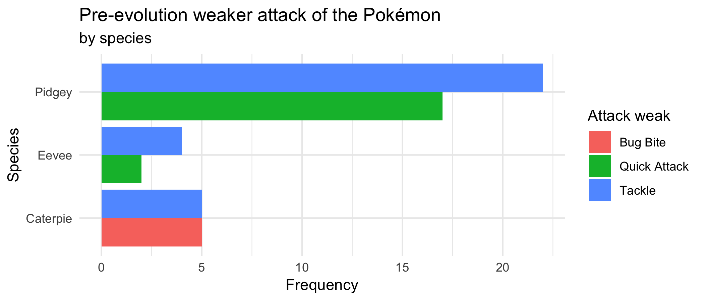

```{r}


```

A key part of [Pokémon Go](http://www.Pokémongo.com/) is using evolutions to get stronger Pokémon, and a deeper understanding of evolutions is key to being the greatest Pokémon Go player of all time. The data set you will be working with for this assignment covers 75 Pokémon evolutions spread across four species. A wide set of variables are provided, allowing a deeper dive into what characteristics are important in predicting a Pokémon's final combat power (CP).

## Data

The dataset for this assignment can be found as a csv file on BlueLine. The variable descriptions are as follows:

- `name`: A unique name given to the Pokémon
- `species`: The Pokémon's type, e.g. Pidgey.
- `cp`: Pre-evolution Combat Power, which is a summary of the Pokémon's strength 
for battling prior to the evolution of the Pokémon.
- `hp`: Pre-evolution Hit Points, which is a summary of how difficult it is to 
weaken the Pokémon in a battle.
- `weight`: Pre-evolution weight, in kilograms.
- `height`: Pre-evolution height, in meters.
- `power_up_stardust`: Pre-evolution stardust required to power up the Pokémon.
- `power_up_candy`: Pre-evolution candy required to power up the Pokémon.
- `attack_weak`: The name of the pre-evolution weaker attack of the Pokémon.
- `attack_weak_type`: The type of the pre-evolution weaker attack.
- `attack_weak_value`: The damage done by the pre-evolution weaker attack.
- `attack_strong`: The name of the pre-evolution stronger attack.
- `attack_strong_type`: The type of the pre-evolution stronger attack.
- `attack_strong_value`: The damage done by the pre-evolution stronger attack.
- `cp_new`: Post-evolution Combat Power.
- `hp_new`: Post-evolution Hit Points.
- `weight_new`: Post-evolution weight, in kilograms.
- `height_new`: Post-evolution height, in meters.
- `power_up_stardust_new`: Post-evolution stardust required to power up the 
Pokémon.
- `power_up_candy_new`: Post-evolution candy required to power up the Pokémon.
- `attack_weak_new`: The name of the post-evolution weaker attack.
- `attack_weak_type_new`: The type of the post-evolution weaker attack.
- `attack_weak_value_new`: The damage done by the post-evolution weaker attack.
- `attack_strong_new`: The name of the post-evolution stronger attack.
- `attack_strong_type_new`: The type of the post-evolution stronger attack.
- `attack_strong_value_new`: The damage done by the post-evolution stronger 
attack.
- `notes`: Any additional notes made while collecting the data.

## Exercises

> 1. Calculate the difference in heights pre and post evolution and save this as a new variable. Calculate the percentage of Pokémon that grew during evolution. Also visualize the distribution of change in height by species and provide a discussion of how change in height varies across species. (Include a link to any online examples you use to help.)

> 2. Recreate the following plot.

```{r, echo=FALSE, out.height = '80%'}

```

> 3. Pick two categorical variables and make a bar plot that depicts the relationship between them. These can be variables from the original data or ones that you create based on the given data.

> 4. Pick a numerical and a categorical variable, and construct side-by-side box plots depicting the relationship between them.

> 5. Learn something new: violin plots! Read about them at http://ggplot2.tidyverse.org/reference/geom_violin.html, and convert your side-by-side box plots from the previous task to violin plots. What do the violin plots reveal that box plots do not? What features are apparent in the box plots but not in the violin plots?

> 6. What characteristics correspond to an evolved Pokémon with a high combat power? You do not need to come up with an exhaustive list, but you should walk through your reasoning for answering this question and include all relevant summary statistics and visualizations.